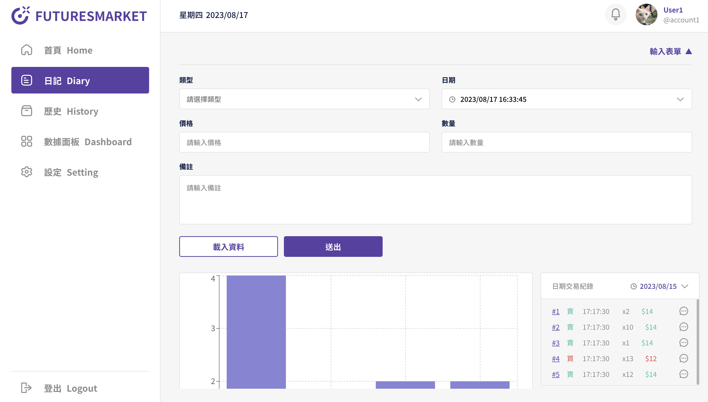
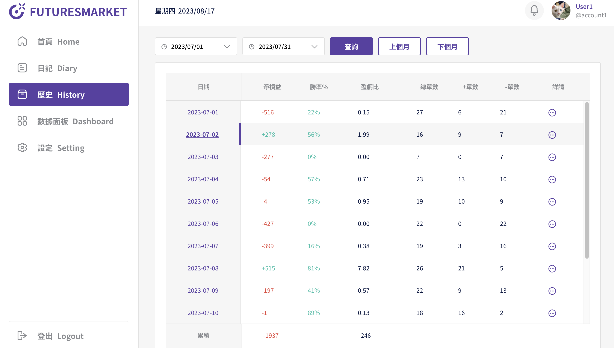

# 📈 Stock-chart 前後分離協作專案

## 作品連結：[Stock-chart]( https://owenlu0125.github.io/StockChart/ )

## 頁面截圖：

## 功能說明

- 使用者登入註冊後，輸入自己的交易紀錄，即可從圖表中，知道自己交易獲益曲線。
- 輸入交易紀錄後，可從歷史頁面查詢過往的交易資料。
- dashboard 功能可得知過往所有交易的獲利曲線
- 可以分享自己的交易紀錄、策略給其他使用者看。

##  使用說明

      1.  確認已經安裝 node.js 與 npm
      2.  clone 專案
      3.  終端機進入資料夾並輸入：npm i 
      4.  安裝完畢後，繼續輸入：npm run start

## 測試帳號

      前台：
      ---
      Account: account1
      Password: 123
      ---
      Account: account2
      Password: 12345
      ---
